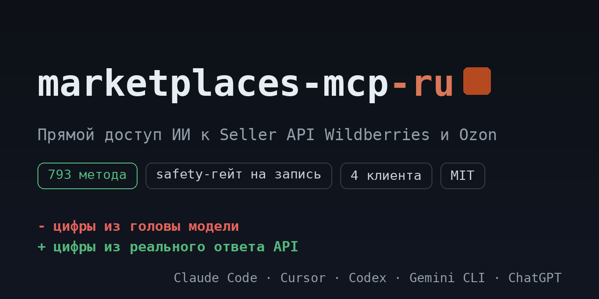

# marketplaces-mcp-ru: Wildberries, Ozon, Яндекс Маркет и Авито в вашем ИИ-ассистенте

<!-- mcp-name: io.github.ilyautov/marketplaces-mcp-ru -->

> 🇬🇧 [English version](README.en.md)

Подключает ИИ-ассистента (Claude, Cursor, Codex, Cowork и др.) напрямую к вашим кабинетам Wildberries, Ozon, Яндекс Маркета и Авито. Вы спрашиваете обычными словами, агент берёт продажи, заказы, остатки, цены, финансы и отзывы прямо из API маркетплейса (WB Seller API, Ozon Seller API, Yandex Market Partner API, Avito API), а не выдумывает цифры.

[](https://pypi.org/project/marketplaces-mcp-ru/)
[](https://registry.modelcontextprotocol.io/)
[](LICENSE)
[](#как-это-устроено)
[](https://marketplaces-mcp-ru.aifrontier.tech/)
[](https://github.com/ilyautov/marketplaces-mcp-ru/stargazers)
[](https://github.com/ilyautov/marketplaces-mcp-ru/pkgs/container/marketplaces-mcp-ru)
[](https://vscode.dev/redirect/mcp/install?name=marketplaces-ru&config=%7B%22command%22%3A%22uvx%22%2C%22args%22%3A%5B%22marketplaces-mcp-ru%22%5D%2C%22env%22%3A%7B%22WB_API_TOKEN%22%3A%22%24%7Binput%3Awb_api_token%7D%22%2C%22OZON_CLIENT_ID%22%3A%22%24%7Binput%3Aozon_client_id%7D%22%2C%22OZON_API_KEY%22%3A%22%24%7Binput%3Aozon_api_key%7D%22%2C%22YANDEX_MARKET_API_KEY%22%3A%22%24%7Binput%3Ayandex_api_key%7D%22%2C%22AVITO_CLIENT_ID%22%3A%22%24%7Binput%3Aavito_client_id%7D%22%2C%22AVITO_CLIENT_SECRET%22%3A%22%24%7Binput%3Aavito_client_secret%7D%22%7D%7D&inputs=%5B%7B%22id%22%3A%22wb_api_token%22%2C%22type%22%3A%22promptString%22%2C%22description%22%3A%22Wildberries%20API%20token%20%28leave%20empty%20if%20you%20don%27t%20sell%20on%20WB%29%22%2C%22password%22%3Atrue%7D%2C%7B%22id%22%3A%22ozon_client_id%22%2C%22type%22%3A%22promptString%22%2C%22description%22%3A%22Ozon%20Client-Id%20%28leave%20empty%20if%20you%20don%27t%20sell%20on%20Ozon%29%22%7D%2C%7B%22id%22%3A%22ozon_api_key%22%2C%22type%22%3A%22promptString%22%2C%22description%22%3A%22Ozon%20Api-Key%22%2C%22password%22%3Atrue%7D%2C%7B%22id%22%3A%22yandex_api_key%22%2C%22type%22%3A%22promptString%22%2C%22description%22%3A%22Yandex%20Market%20Api-Key%20%28leave%20empty%20if%20you%20don%27t%20sell%20there%29%22%2C%22password%22%3Atrue%7D%2C%7B%22id%22%3A%22avito_client_id%22%2C%22type%22%3A%22promptString%22%2C%22description%22%3A%22Avito%20client_id%20%28leave%20empty%20if%20you%20don%27t%20sell%20on%20Avito%29%22%7D%2C%7B%22id%22%3A%22avito_client_secret%22%2C%22type%22%3A%22promptString%22%2C%22description%22%3A%22Avito%20client_secret%22%2C%22password%22%3Atrue%7D%5D)
[](https://cursor.com/en/install-mcp?name=marketplaces-ru&config=eyJjb21tYW5kIjoidXZ4IiwiYXJncyI6WyJtYXJrZXRwbGFjZXMtbWNwLXJ1Il0sImVudiI6eyJXQl9BUElfVE9LRU4iOiIiLCJPWk9OX0NMSUVOVF9JRCI6IiIsIk9aT05fQVBJX0tFWSI6IiIsIllBTkRFWF9NQVJLRVRfQVBJX0tFWSI6IiIsIkFWSVRPX0NMSUVOVF9JRCI6IiIsIkFWSVRPX0NMSUVOVF9TRUNSRVQiOiIifX0=)

<p align="center">
  <a href="https://marketplaces-mcp-ru.aifrontier.tech/">
    
  </a>
</p>

**Быстрый старт**, без установки в систему:

```bash
uvx marketplaces-mcp-ru
```

<!-- social preview: assets/social-preview.png → Settings → Social preview.
     Сайт: marketplaces-mcp-ru.aifrontier.tech (GitHub Pages из docs/). -->

## Зачем

Вы продаёте на нескольких площадках, а данные лежат в разных кабинетах. Продажи, остатки, цены, финансы, отзывы: всё руками, по очереди, через несколько браузеров. Обычный ИИ-ассистент тут мало помогает. Либо ходит через браузер и спотыкается о капчу, либо называет цифры, которые звучат уверенно, но взяты из воздуха.

Этот проект решает задачу иначе. Он даёт ассистенту прямой доступ к API всех четырёх площадок:

- Цифры приходят из ответа Wildberries, Ozon, Яндекс Маркета и Авито, с указанием источника и полей. Не пересказ, не догадка.
- Перед тем как менять цену или остаток, агент просит подтверждение. Случайно «уронить цену в три раза» не получится.
- Никакого браузера и капчи: обращение идёт по токену кабинета напрямую.

Спросите обычными словами: «покажи продажи за неделю на всех площадках», «что пора дозаказать», «сравни мои цены с рынком». Агент подберёт нужный метод или готовый сценарий и проведёт по шагам.

> ⚠️ Версия alpha. Помогает с операционкой продавца, но это инструмент, а не замена аналитику. Проверенное вручную ядро (продажи, остатки, цены, финансы, отзывы) выверено на реальных кабинетах. Остальные методы импортированы из спецификаций и служат картой для разведки. Подробности в разделе [Оговорки](#оговорки).

## Что можно спросить

Просто пишите агенту в чат по-русски:

```
покажи продажи за неделю на WB и Ozon и сравни
какие заказы на Яндекс Маркете ждут отгрузки сегодня
подтверди новые заказы Авито Доставки и покажи, где кончается остаток
что пора дозаказать, посчитай дни покрытия по остаткам и продажам
вытащи финотчёт реализации WB за прошлый месяц
какие товары на Ozon с красным индексом цены
собери отзывы ниже 4 звёзд за неделю и сгруппируй жалобы по товару
сделай ABC-анализ по выручке и покажи товары-хвост
```

Не знаете, с чего начать, скажите «что ты умеешь по моему кабинету». Агент покажет готовые сценарии: для Wildberries это пульс продаж, здоровье остатков, аудит цен, планировщик дозаказа, ABC-анализ, сводка отзывов; для Ozon: риск out-of-stock, анализ цен, юнит-экономика, синхронизация каталога, аудит контента и те же ABC и отзывы; для Яндекс Маркета: риск out-of-stock, анализ цен, разбор отзывов, индекс качества; для Авито: заказы на подтверждение, здоровье объявлений, расходы против результата, разбор отзывов. Каждый сценарий это пошаговый рецепт с трактовкой результата и типичными ошибками.

## Установка

Подробный гайд под любую аудиторию лежит в [QUICKSTART.md](QUICKSTART.md). Несколько способов, результат один.

1. **Claude Desktop в один клик (`.mcpb`).** Возьмите `marketplaces-mcp-ru-v<версия>.mcpb` из [GitHub Releases](https://github.com/ilyautov/marketplaces-mcp-ru/releases) и дважды кликните — Claude Desktop сам поставит расширение и спросит ключи в окне настроек. Без терминала и без Gatekeeper. Один бандл поднимает WB + Ozon + Ozon Performance + Яндекс Маркет + Авито сразу.
2. **Попросить своего ИИ (без терминала).** Откройте Claude или Cowork и скажите: «установи marketplaces-mcp-ru». Агент проведёт по встроенному скиллу `marketplace-mcp-install/`. В песочнице Cowork финальный клик остаётся за вами; в Claude Code установка проходит полностью сама.
3. **Скачать и кликнуть.** Возьмите `marketplaces-mcp-ru-v<версия>.zip` из [GitHub Releases](https://github.com/ilyautov/marketplaces-mcp-ru/releases), распакуйте, дважды кликните `install.command` (macOS) или `install.bat` (Windows), вставьте ключи. На macOS при первом запуске: правый клик → «Открыть» → «Открыть» (так обходится Gatekeeper для скачанного файла).
4. **Через терминал.** `git clone https://github.com/ilyautov/marketplaces-mcp-ru`, затем `python3 install.py --client <ваш-клиент>`.
5. **Для разработчиков (`npx` / `uvx`).** `npx -y marketplaces-mcp-ru` — та же строка, что в конфигах всех MCP-клиентов; Python ставить не нужно, запускалка с npm сама подтянет `uv` и нужную версию с PyPI. `uvx marketplaces-mcp-ru` запускает объединённый сервер прямо из PyPI; отдельные серверы — консольными командами `wb-mcp` / `ozon-mcp` / `ozon-perf-mcp` / `yandex-mcp` / `avito-mcp`. Ключи — через переменные окружения или те же `*_add_cabinet` из чата.
6. **VS Code / Cursor в один клик.** Кнопки «поставить» над этим текстом открывают редактор и прописывают `uvx marketplaces-mcp-ru` в его конфиг MCP; VS Code сразу спросит ключи, в Cursor их вписывают в открывшийся JSON.
7. **Docker.** `docker run -i --rm -e WB_API_TOKEN=… -e OZON_CLIENT_ID=… -e OZON_API_KEY=… ghcr.io/ilyautov/marketplaces-mcp-ru` — тот же объединённый сервер по stdio, без Python на машине. Этот образ и указан в [MCP Registry](https://registry.modelcontextprotocol.io/) как OCI-пакет. Для удалённого доступа добавьте `-e MCP_TRANSPORT=http -e MCP_HTTP_HOST=0.0.0.0 -p 8000:8000`: сервер поднимется на `http://…:8000/mcp` (Streamable HTTP). Своей авторизации у HTTP-режима нет, закрывайте его прокси или файрволом.

Установщик копирует приложение в стабильную папку (`~/.marketplace-mcp/app`) и привязывает конфиг туда, так что исходную папку потом можно перемещать или удалять, ничего не сломается. Ни `pip install`, ни ручной правки JSON: зависимости ставятся сами при первом запуске. От вас нужны только ключи. Поддерживается 4 клиента через `--client`: `claude-desktop` и `opencode` получают готовый конфиг, `claude-code` и `codex` получают готовые команды `mcp add`.

**Где взять ключи.** Wildberries: seller.wildberries.ru → Настройки → Доступ к API. Ozon: seller.ozon.ru → Настройки → API-ключи. Яндекс Маркет: partner.market.yandex.ru → Настройки → Доступ к API (Api-Key). Авито: avito.ru → Для бизнеса → Интеграции → API (client_id + client_secret). Ключи хранятся в `~/.marketplace-mcp/cabinets.json` локально (`chmod 600`), в репозиторий и в чат не попадают. Можно подключить несколько магазинов и переключаться между ними прямо из чата (`*_add_cabinet` / `*_use_cabinet`).

**Проверка после установки:** одна команда показывает по всем пяти серверам, сколько инструментов и методов загрузилось, найдены ли ключи и где (кабинет / env), а с `--live` делает по одному реальному read-вызову в каждый кабинет.

```bash
python3 serve.py doctor --live          # из клона
uvx marketplaces-mcp-ru doctor --live   # из PyPI
npx -y marketplaces-mcp-ru doctor --live  # то же через npm, без Python
```

Код возврата 0 означает, что все настроенные кабинеты ответили. Секреты в вывод не попадают.

## Безопасность

Ключ кабинета двигает цены, остатки и деньги, поэтому каждый метод заранее размечен по уровню риска:

- `read`: чтение, выполняется сразу;
- `write`: изменение, требует `confirm_write=true`;
- `destructive`: удаление, требует `confirm_write=true` и `i_understand_this_modifies_data=true`.

Проверка работает локально, наружу без подтверждения ничего не уходит. Что метод-мутация случайно не пометится как `read`, проверяет тест в CI (`test_safety_catalog.py`): сборка падает, если в каталог попадёт PUT, PATCH или DELETE с уровнем `read`. Дополнительно `call_method` подстраховывается на лету: даже устаревшая пометка `read` на мутирующем запросе не опустит проверку ниже `write`.

Подробнее в [SECURITY.md](SECURITY.md). О найденной уязвимости пишите на ilyautov@gmail.com с темой `SECURITY: marketplaces-mcp-ru`, без публичного issue.

## Как это устроено

Под капотом пять MCP-серверов (Wildberries, Ozon Seller, Ozon Performance, Яндекс Маркет, Авито) на общем ядре. Вместо «один инструмент на каждый эндпоинт» (это 300+ инструментов, в которых агент теряется) сделано иначе: 8 универсальных мета-инструментов поверх каталога методов. Полное покрытие API при компактной поверхности.

```
ваш ИИ-агент
      │
      ▼
 8 мета-инструментов  ──►  каталог (endpoints.yaml)  ──►  общее ядро
 search / describe /                                      клиент · safety · ошибки
 call / call_raw /                                        пагинация · реестр
 fetch_all / ...                                                │
 + типизированные инструменты (wb_get_sales, …)                 ▼
                          Wildberries / Ozon / Яндекс Маркет / Авито HTTPS API
```

Мета-инструменты одинаковы на всех серверах (префикс `wb_`, `ozon_`, `ozon_perf_`, `ym_` или `avito_`):

| Инструмент | Что делает |
|---|---|
| `*_check_auth` | Проверяет наличие ключей (секреты не печатает) |
| `*_search_methods` | Ищет метод по-русски или по-английски |
| `*_describe_method` | Полное описание: метод, хост, путь, scope, уровень риска, лимит, ссылка на доку |
| `*_call_method` | Вызывает любой метод каталога через проверку безопасности |
| `*_call_raw` | Вызывает любой путь, даже которого ещё нет в каталоге (полное покрытие) |
| `*_fetch_all` | Авто-пагинация (offset / last_id / cursor / date-курсор WB / pageToken Маркета / page Авито) |

Плюс типизированные инструменты для частых задач (`wb_get_sales`, `wb_get_stocks`, `ozon_get_products`, `ozon_get_prices`, `ym_get_orders`, `ym_set_price`, `avito_get_orders`, `avito_update_stock` и др.) и инструменты управления кабинетами.

Каталог собран schema-driven из официальных OpenAPI-спецификаций:

| Каталог | Файл | Методов | Секций |
|---|---|---:|---|
| Wildberries | `wb_mcp/endpoints.yaml` | 307 | 70 |
| Ozon Seller | `ozon_mcp/endpoints.yaml` | 441 | 67 |
| Ozon Performance (реклама) | `ozon_mcp/perf_endpoints.yaml` | 45 | 6 |
| Яндекс Маркет (Partner API) | `yandex_mcp/endpoints.yaml` | 165 | 29 |
| Авито (API для бизнеса) | `avito_mcp/endpoints.yaml` | 64 | 8 |

Ядро (продажи, остатки, цены, финансы, отзывы) выверено вживую; остальное импортировано из спецификаций, а `call_raw` достаёт то, чего ещё нет в каталоге. Что покрыто по бизнес-областям:

| Область | Wildberries | Ozon |
|---|---|---|
| Продажи и заказы | продажи, заказы, сборочные задания FBS / DBS / DBW / Самовывоз | заказы FBO / FBS, отправления, возвраты |
| Остатки и склады | остатки, склады продавца, поставки FBS | остатки по складам, FBO / FBS, аналитика остатков |
| Цены и скидки | цены и скидки, календарь акций | цены, стратегии ценообразования, акции |
| Финансы | финотчёт реализации, баланс | транзакции, начисления, реализация, компенсации |
| Контент и карточки | карточки, категории, характеристики, медиа | товары, атрибуты, категории, сертификаты |
| Отзывы и вопросы | отзывы, вопросы | отзывы (нужен Premium Plus), вопросы и ответы |
| Реклама | управление кампаниями, статистика | Performance API (отдельный сервер) |

Яндекс Маркет и Авито (добавлены в 0.5.0):

| Область | Яндекс Маркет | Авито |
|---|---|---|
| Заказы | заказы FBS / DBS / Экспресс, статусы, возвраты, отгрузки | заказы Авито Доставки, подтверждение, трек-номера, маркировка |
| Товары и остатки | каталог, карточки, остатки по складам, скрытые товары | объявления, остатки в объявлениях, автозагрузка |
| Цены | цены, карантин цен, акции, рекомендации | цена объявления |
| Отзывы и чаты | отзывы, вопросы, чаты с покупателями | рейтинг, отзывы и ответы, мессенджер |
| Аналитика | статистика заказов и товаров, 27 отчётов, индекс качества | просмотры и контакты, расходы, звонки |
| Продвижение | буст продаж, ставки | услуги продвижения, BBIP |
| Аналитика | воронка продаж, отчёты | аналитические отчёты, оборачиваемость |

Полный список секций покажет `*_list_sections` прямо в чате, точечный поиск делает `wb_search_methods("остатки")`.

## Разработка

Раздел для тех, кто хочет покопаться в коде, выверить методы боем или прислать PR.

**Структура.** Вся общая логика живёт в `core/`, серверы это тонкие обёртки над ней:

```
core/                общее ядро всех серверов
  client.py          HTTPS-клиент (хосты, заголовки, ретраи)
  credentials.py     загрузка ключей из cabinets.json / env
  safety.py          гейт read / write / destructive
  registry.py        загрузка и индексация каталога endpoints.yaml
  paginate.py        авто-пагинация (offset / last_id / cursor / date / pageToken / page)
  entities.py        нормализация сущностей (товары, заказы и т.д.)
  workflows.py       движок пошаговых сценариев
  tools.py           регистрация мета-инструментов в MCP
  transport.py       выбор транспорта: stdio (по умолчанию) или Streamable HTTP
  doctor.py          диагностика: инструменты, каталоги, ключи, живой пинг
  errors.py          единый формат ошибок
wb_mcp/              сервер WB: server.py + endpoints.yaml + workflows.yaml
ozon_mcp/            сервер Ozon: server.py + endpoints.yaml + perf_endpoints.yaml + workflows.yaml
ozon_perf_mcp/       сервер Ozon Performance (реклама, OAuth2)
yandex_mcp/          сервер Яндекс Маркета: server.py + endpoints.yaml + workflows.yaml
avito_mcp/           сервер Авито: server.py + endpoints.yaml + workflows.yaml (OAuth2)
scripts/             сборка каталогов, валидация, релиз
tests/               офлайн-тесты (токены не нужны)
```

**Локальный запуск и тесты.** Нужен Python 3.10+. Зависимости (`mcp`, `httpx`, `pyyaml`) `serve.py` ставит сам в локальный `.venv` при первом запуске.

```bash
git clone https://github.com/ilyautov/marketplaces-mcp-ru.git
cd marketplaces-mcp-ru

# офлайн-тесты, ключи не нужны — все офлайн-тесты зелёные
env -u OZON_CLIENT_ID -u OZON_API_KEY -u WB_API_TOKEN python3 -m pytest tests/ -q

# selfcheck серверов: 21 тул для wb, 21 для ozon, 16 для ozon-perf, 22 для yandex, 26 для avito
python3 serve.py wb --selfcheck
python3 serve.py ozon --selfcheck
python3 serve.py ozon-perf --selfcheck
python3 serve.py yandex --selfcheck
python3 serve.py avito --selfcheck

# всё сразу: инструменты, каталоги, ключи, живой пинг кабинетов
python3 serve.py doctor --live

# образ для MCP Registry / удалённого запуска
docker build -t marketplaces-mcp-ru .
docker run --rm marketplaces-mcp-ru doctor
```

**Транспорт.** По умолчанию stdio, как ждут Claude Desktop, Cursor, Codex и Claude Code. `MCP_TRANSPORT=http` переключает любой из серверов (и объединённый) на Streamable HTTP: `MCP_HTTP_HOST` (по умолчанию `127.0.0.1`), `MCP_HTTP_PORT` (`8000`), `MCP_HTTP_ALLOWED_HOSTS` — список допустимых заголовков `Host` через запятую, защита от DNS-rebinding при публикации наружу. Аутентификации у HTTP-режима нет: кто дотянулся до порта, тот работает с вашими ключами. Держите его на localhost или за прокси.

**Как устроен и растёт каталог.** `endpoints.yaml` собирается schema-driven из официальных OpenAPI-спеков: `ingest_specs.py` (WB) и `ingest_ozon.py` (Ozon) тянут пути, `derive_pagination.py` и `fix_items_path_from_examples.py` настраивают пагинацию и `items_path`, `sync_swagger.py` подтягивает свежие спеки. Запись каждого метода описывает `operation_id`, метод, хост, путь, scope, уровень риска и пагинацию. Импорт идемпотентный и аддитивный: курированные уровни риска и описания не перетираются. `validate_items_path.py` это live-валидатор (гонять локально на своих ключах), `package_release.py` собирает чистый версионный zip, `smoke_mcp.py` это дымовой тест.

**Что особенно полезно прислать:**

- Боевую выверку HTTP-глаголов. Пути у импортированных методов надёжны, а глаголы нет: live-проба находила «GET», которые на деле POST (405). Поправьте `*/endpoints.yaml` и приложите доказательство: код ответа или ссылку на доку.
- Новые сценарии в `*/workflows.yaml`: пошаговые рецепты с трактовкой и типичными ошибками, каждый шаг сверяется с каталогом.
- Уточнение safety-классификации, если метод размечен слишком мягко или строго.

Полностью правила в [CONTRIBUTING.md](CONTRIBUTING.md). Перед PR прогоните офлайн-тесты и `--selfcheck` всех серверов; изменили число методов или тулов, поправьте цифры в README.

**Безопасность репозитория.** Гайдлайны для людей и агентов лежат в [AGENTS.md](AGENTS.md). Секреты живут только локально: `.env`, `cabinets.json`, ключи и сертификаты закрыты `.gitignore`, а pre-commit прогоняет `scripts/security/forbid_sensitive_files.py` и `scan_mcp_config.py`. Что мутирующий метод не попадёт в каталог с уровнем `read`, держит тест `test_safety_catalog.py`: сборка падает на PUT, PATCH или DELETE с пометкой `read`. Файл `.mcp.json` отслеживается намеренно, это манифест плагина без секретов.

## Частые вопросы

**Нужно ли уметь программировать?** Нет. Есть установка «попроси своего ИИ» и установка двойным кликом. `pip install` и правка JSON не нужны, зависимости ставятся сами, от вас только API-ключ.

**Это безопасно? Куда уходят ключи?** Сервер работает там же, где ваш агент, локально. Ключи лежат в `~/.marketplace-mcp/cabinets.json` (`chmod 600`), в репозиторий и в чат не попадают. Любое изменение в кабинете (цена, остаток) происходит только с вашим подтверждением.

**Чем это лучше парсеров и браузерных ботов?** Это прямой Seller API по токену, а не разбор веб-страниц: нет капчи, нет блокировок, данные приходят структурированными. Плюс защита от случайного изменения цены или остатка.

**Это бесплатно?** Да, открытый код под лицензией MIT. Берите, форкайте, дорабатывайте.

**Работает ли с Яндекс Маркетом и Авито?** Да, с версии 0.5.0. Яндекс Маркет подключается по Api-Key из кабинета партнёра (Partner API: заказы, товары, остатки, цены, отчёты, чаты, индекс качества). Авито — по паре client_id / client_secret из раздела «Интеграции» (заказы Авито Доставки, остатки и цены объявлений, статистика, отзывы, мессенджер, продвижение). Сервера `yandex-mcp` и `avito-mcp` работают и отдельно, и в составе объединённого.

**Что такое MCP и зачем он продавцу?** MCP (Model Context Protocol) — открытый стандарт, по которому ИИ-ассистент подключает внешние инструменты. Этот проект — MCP-сервер для маркетплейсов: он превращает API Wildberries, Ozon, Яндекс Маркета и Авито в инструменты, которые агент вызывает сам, по вашему вопросу на русском языке.

## Оговорки

Сверяйте с живой документацией маркетплейсов:

- **WB `Authorization`**: сервер шлёт raw-токен без префикса `Bearer` (подтверждено на практике). Если авторизация падает, проверьте это в первую очередь.
- **Импортированные из спецификаций методы: пути надёжны, HTTP-глаголы не всегда.** Live-проба находила методы, помеченные GET, которые на деле POST (ответ 405). Считайте такие записи картой для разведки: подтверждайте глагол и тело по докам или вызывайте через `call_raw`. Курированное ядро (7 категорий WB, 4 секции Ozon) и live-выверенный набор надёжны.
- **Ozon дрейфует по версиям** (list v3, attributes v4, prices v5). При 404 проверьте версию; `ingest_ozon.py` пере-выравнивает пути.
- **Ozon Performance**: пока каталог-артефакт плюс OAuth-обвязка по докам. Контракт токен-эндпоинта вживую не выверен, нужны рекламные креды.
- **Яндекс Маркет и Авито (новое в 0.5.0)**: каталоги собраны из официальных OpenAPI-документов, типизированные инструменты написаны по спецификации, но живой прогон на реальных кабинетах ещё не делался. Ошибки в именах полей возможны, `describe_method` и `call_raw` помогут поправить запрос на месте.
- **Кабинет затеняет переменные окружения.** Активный кабинет в `cabinets.json` имеет приоритет над env. Необъяснимый 401 или «Client-Id should be positive integer»: первым делом проверьте этот файл.

## Чем это не является

Это инструмент для ИИ-агента, а не онлайн-сервис «в один клик» и не замена аналитику. Решение, которое меняет цены, остатки или деньги, всегда остаётся за вами, защита лишь не даёт сделать это случайно. Проект на стадии alpha: ставьте, проверяйте на своих данных, экспериментируйте. Нашли проблему, заведите [issue](https://github.com/ilyautov/marketplaces-mcp-ru/issues) (без реальных ключей и данных кабинета).

Архитектура взяла сильные идеи зрелых marketplace-MCP (schema-driven каталог, проверка безопасности, единый формат ошибок, авто-пагинация), но реализована своим кодом, без зависимости от чужих библиотек.

## Лицензия

MIT.

---

## Кто это сделал

[Илья Утов](https://github.com/ilyautov), лаборатория [AI Frontier](https://aifrontier.tech). Как эти инструменты устроены внутри, пишу в [Telegram](https://t.me/gorilla_under_hood) и [LinkedIn](https://www.linkedin.com/in/ilyautov).

**Рядом стоят:**

- [**humanizer-ru**](https://github.com/ilyautov/humanizer-ru): убирает следы нейросети из русского текста
- [**small-business-ru**](https://github.com/ilyautov/small-business-ru): 34 скилла для малого бизнеса, считают налоги и проверяют контрагента по ИНН
- [**consilium-principis**](https://github.com/ilyautov/consilium-principis): совет мыслителей, где каждая цитата сверяется дословно
- [**hefest**](https://github.com/ilyautov/hefest): химическая безопасность завода, целиком офлайн
- [**cordon**](https://github.com/ilyautov/cordon): детерминированный слой между недоверенным контентом и действиями агента

Все проекты: [github.com/ilyautov](https://github.com/ilyautov). Пригодилось, поставьте звезду: по ней это находят другие.
